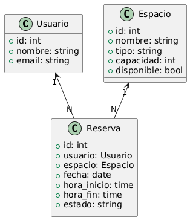

# TP FINAL ARQUITECTURA DE SOFTWARE 
# Sistema de Reservas de Espacios

## Arquitectura

Este sistema permite a los usuarios registrarse, gestionar reservas de espacios y ver su disponibilidad (ejemplo. Salones, auditorios, canchas), además el administrador podrá revisar las reservas existentes.
La aplicación esta desarrollada en Django con una organización modular que separa la lógica de negocio, la interfaz y el acceso a datos, sus módulos clave son:

    • Usuarios
    • Reservas
    • Espacios

## Diagramas UML
Los diagramas se encuentran en la carpeta `diagrams/`:

### Diagrama de Componentes - Nivel 1


### Diagrama de Componentes - Nivel 2


## Documentación

Toda la documentación se encuentra en la carpeta `docs/`, incluyendo:

- ADRs (`docs/adr/`)
- Atributos de calidad (`docs/atributos_de_calidad.md`)
- Documento PDF

## Pruebas

Hay pruebas unitarias para:

- Crear reserva
- Ver reservas

Ubicadas en la carpeta `tests/`.

Ejecutar con:

```bash
python manage.py test tests
```

## Tecnologias

* Django
* SQlite
* Python 3.10
* conda env

## Requisitos y entorno de desarrollo

Este proyecto incluye un archivo `environment.yml` para facilitar la creación de un entorno virtual con todas las dependencias necesarias.

### Requisitos previos
- Python 3.10+
- Conda o Miniconda

### Crear entorno virtual
```bash
conda env create -f environment.yml
conda activate reservas
```
Esto instalará automáticamente Django y demás dependencias necesarias para ejecutar la aplicación.
##  Estructura del repositorio

- `environment.yml` – Define el entorno de desarrollo reproducible.
- `application/` – Casos de uso (crear y ver reservas, verificar disponibilidad).
- `domain/` – Modelos de dominio (Usuario, Espacio, Reserva).
- `infrastructure/` – Implementación de modelos con Django.
- `web/` – Vistas HTTP y controladores.
- `tests/` – Pruebas unitarias.
- `docs/` – Documentación ADR, atributos de calidad